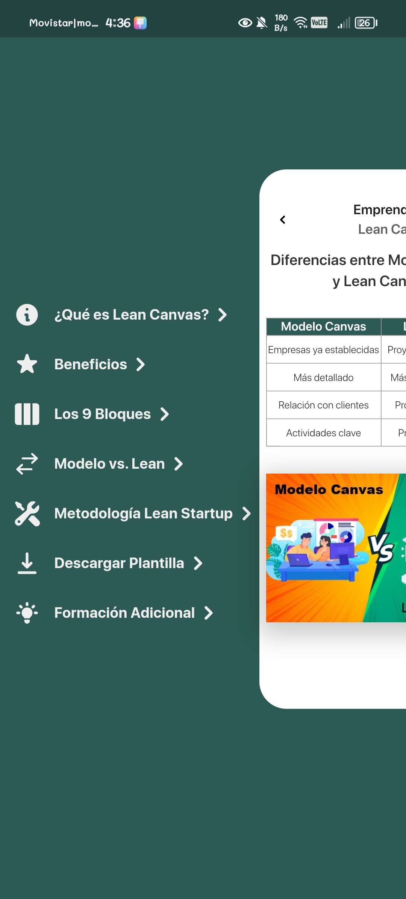

# Crea Ya

Aplicativo sobre como entender los conceptos basicos de Lean Canvas

# Ejemplos de la aplicación

## Características

- **Tutoriales**: Guías paso a paso para completar cada sección del Lean Canvas.
- **Ejemplos**: Ejemplos prácticos para ilustrar cada componente del Lean Canvas.
- **Plantillas**: Acceso a plantillas básicas para empezar rápidamente.

## Uso

1. **Abrir la Aplicación**: Inicia la aplicación en tu dispositivo.
2. **Explorar Tutoriales**: Accede a los tutoriales desde el menú principal para aprender cómo usar el Lean Canvas.
3. **Crear tu Canvas**: Usa la función de plantillas para comenzar a crear tu propio Lean Canvas.